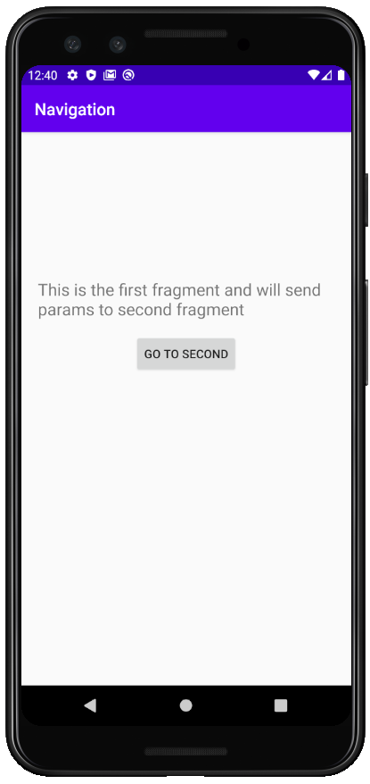
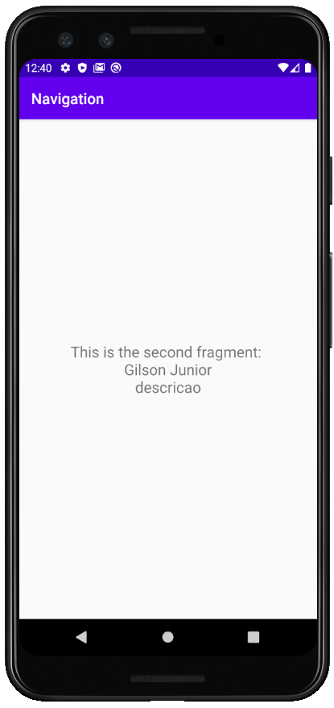
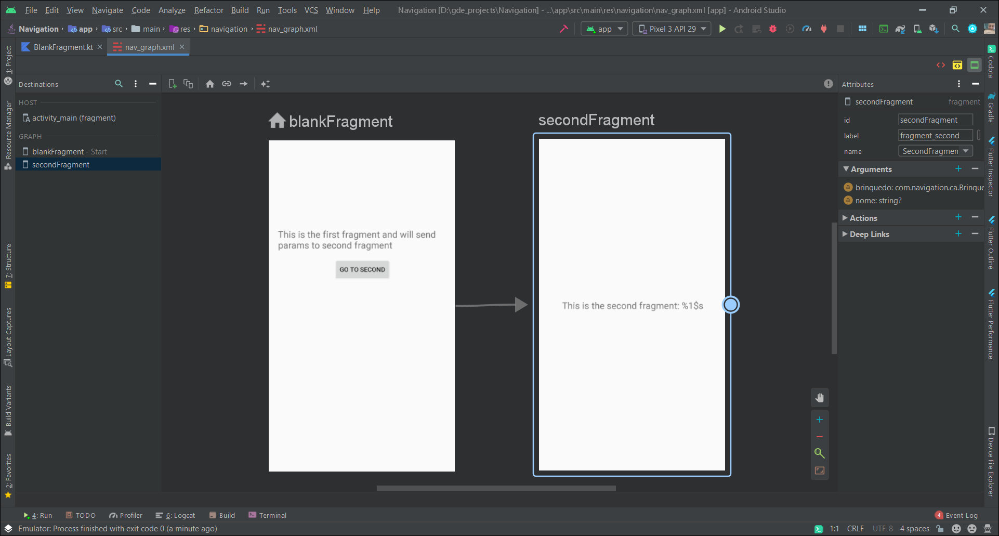

# Navigation

### **Overview - About this project**
This is a simple project to show how to use Navigation component with Fragments and sending 
parameters from one fragment to another using navigation view


### 📷 How is this App
</img>
</img>
</img>


### 💻Technology
- [Kotlin](https://kotlinlang.org/)
- [Navigation Component](https://developer.android.com/guide/navigation)


### Libraries
```bash
    implementation 'androidx.navigation:navigation-fragment-ktx:2.2.1'
    implementation 'androidx.navigation:navigation-ui-ktx:2.2.1'
 ```


### Donation
If this project help you reduce time to develop, you can buy me a cup of coffee :) 

<a href="https://www.buymeacoffee.com/gilsonjuniorpro" target="_blank">
    
</a>
